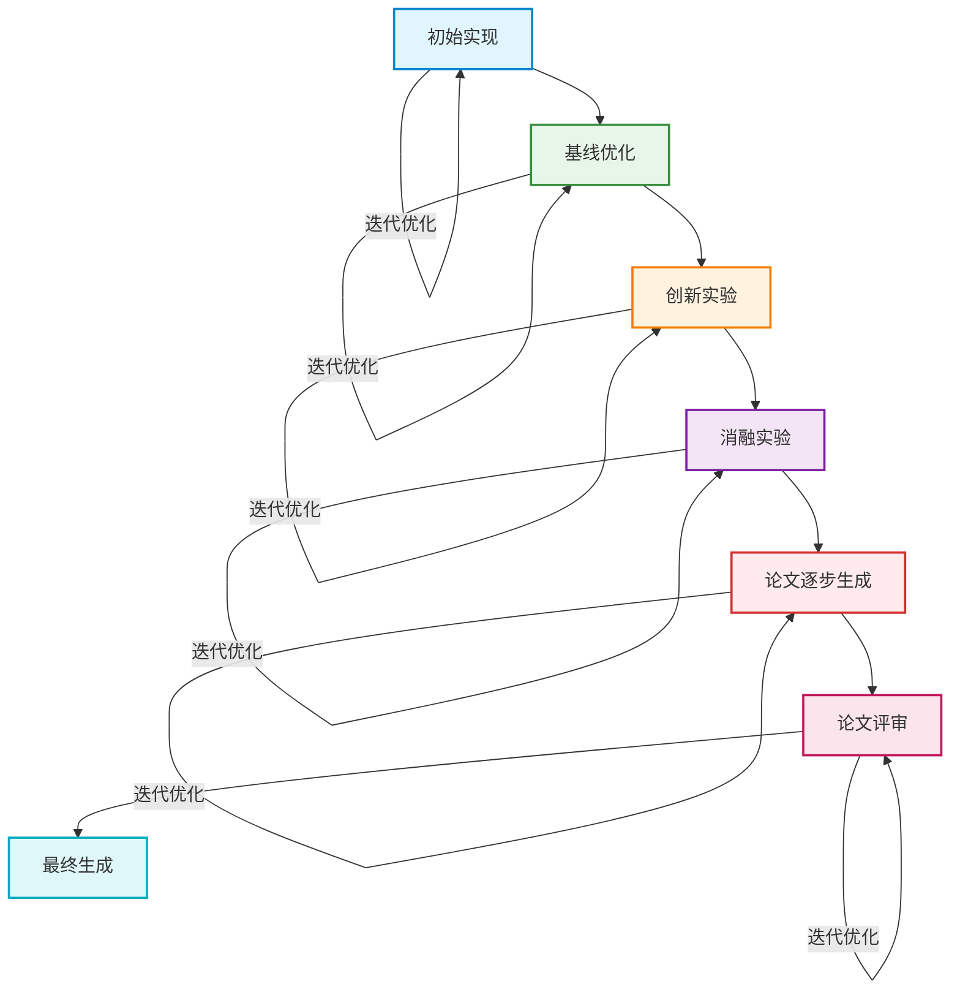

# 📚 Paper Helper Agent - 毕业论文智能辅助助手

> 基于大语言模型的全流程毕业论文自动化写作系统，让学术写作更高效、更轻松。

<div align="center">


</div>

## ✨ 项目简介

Paper Helper Agent 是一款专为学术研究者打造的智能论文辅助工具，基于先进的大语言模型和自主研发的 pi (coding-agent) 框架构建。它提供从选题到答辩的全流程自动化支持，帮助你大幅提升论文写作效率，生成质量可达 6-7/10 分的学术论文。

## 🚀 核心功能

### 五大核心模块

- 📋 **毕业论文流程指导**：全流程时间规划与节点提醒
- 🎯 **智能选题匹配**：基于研究方向自动生成高质量选题
- 📝 **开题报告撰写**：一键生成结构完整的开题报告
- ✍️ **论文修改与润色**：语法纠错、逻辑优化、学术化表达
- 🎤 **模拟答辩准备**：生成答辩问题与参考答案

### 一键论文生成

支持从实验设计到最终论文的完整自动化流程，**每个阶段均支持多次迭代优化**：



## 🖼️ 产品截图

### 网页端主界面

<div align="center">

</div>

### 一键论文生成助手

<div align="center">

</div>

## 🖥️ Paper Helper TUI

命令行版本的毕业论文自动化写作系统，同样基于 pi (coding-agent) 构建，为喜欢终端操作的用户提供高效体验。

## 📦 快速开始

### 首次运行

首次运行程序时，系统会自动进行初始化配置：
- 检查并创建 `~/.paper_helper/` 配置目录
- 生成默认配置文件 `config.json`

> ⚠️ **重要提示**：请务必编辑配置文件并填入有效的 API 密钥后再运行程序。

### 配置文件说明

配置文件根据操作系统的不同位于以下路径：

| 操作系统 | 配置文件路径 |
|---------|-------------|
| macOS / Linux | `~/.paper_helper/config.json` |
| Windows | `%USERPROFILE%\.paper_helper\config.json` |

#### 默认配置模板

```json
{
  "provider": "deepseek",
  "model": "deepseek-chat",
  "apiKey": "your-api-key-here",
  "baseUrl": "https://api.deepseek.com/v1",
  "temperature": 0.7,
  "maxTokens": 4096
}
```

#### 配置项详解

| 配置项 | 类型 | 说明 | 示例值 |
|--------|------|------|--------|
| `provider` | string | 大模型提供商 | `deepseek`, `openai`, `anthropic` |
| `model` | string | 使用的模型名称 | `deepseek-chat`, `gpt-4o`, `claude-3-opus-20240229` |
| `apiKey` | string | **必填** API 密钥 | `sk-xxxxxxxxxxxxxxxxxxxxxxxx` |
| `baseUrl` | string | API 基础地址 | `https://api.deepseek.com/v1` |
| `temperature` | float | 生成温度 (0.0 ~ 2.0) | `0.7` |
| `maxTokens` | integer | 单次生成最大 Token 数 | `4096` |

#### 配置步骤

1. 找到对应操作系统的配置文件路径
2. 使用任意文本编辑器打开 `config.json`
3. 将 `apiKey` 替换为你的真实 API 密钥
4. 根据需要调整 `provider`、`model` 和 `baseUrl` 等参数
5. 保存配置文件
6. 重新运行程序即可开始使用

### 支持的模型提供商

- ✅ **DeepSeek**：推荐使用，性价比高
- ✅ **OpenAI**：GPT 系列模型
- ✅ **Anthropic**：Claude 系列模型
- ✅ 任何兼容 OpenAI API 格式的第三方提供商

## 🤝 贡献指南

欢迎提交 Issue 和 Pull Request 来帮助改进这个项目！

## 📄 许可证

本项目采用 [MIT 许可证](LICENSE) 开源。

<div align="center">❤️
</div>
